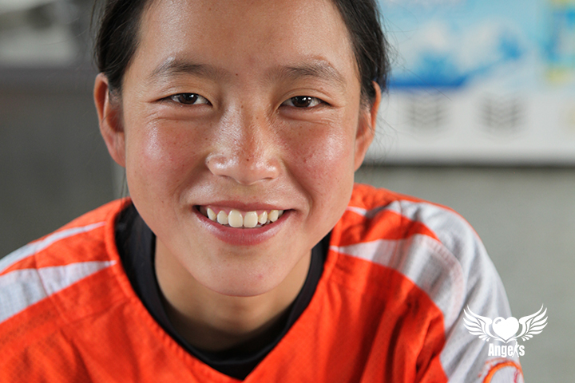
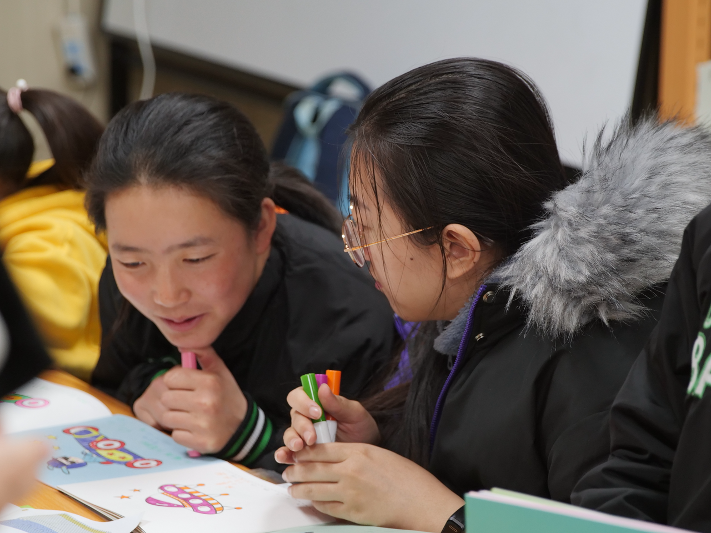
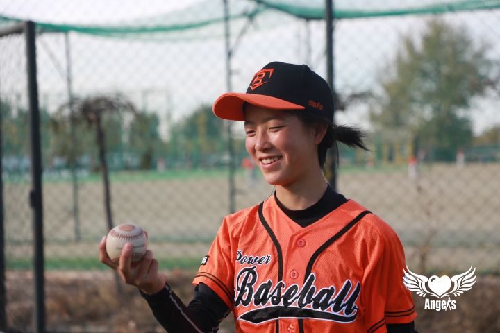

---
layout: post
title:  "阿余女子-强棒少女的陪伴日记"
image:
  feature: 拿棒球棒.jpg
  topPosition: 0px
bgContrast: dark
bgGradientOpacity: darker
syntaxHighlighter: no
---  

## 平凡天使-阿余女子🧚‍♀️ 
  

> hi~哥哥姐姐你好，很高兴认识你.🍬
> 
> 我是阿余女子，出生于2006.3.10.
> 
> 我在2020年9月加入强棒基地，老家在四川凉山州，我是彝族人.  
> 
> 我是队员中的大姐姐，也是女队摩擦时的粘合剂，更是加深女生感情的加温器.  💞

## 快来了解我吧(✿◕‿◕✿)
* [平凡天使]（https://music.163.com/#/outchain/2/1805155516/）  

  我喜欢听邓紫棋的歌曲  
>   
    在闲暇时，我喜欢听着邓紫棋的音乐，她的温暖与力量一直激励着我，陪伴着我的强棒之旅(✿◠‿◠)
* 有时间时，我喜欢在自习室阅读名著。
  
>
    我会和姐妹们探讨查理九世里的故事,但夜里想像个中情节时会被吓到.༼ つ ◕_◕ ༽つ    
    哥哥姐姐们喜欢看什么书呢？也会被书中情节吓到吗？希望可以和哥哥姐姐们分析故事哟.(★ ω ★)
## 来瞧瞧我们的训练吧🏏
  
* 训练计划  
>
    周一到周五的2点-5点是我们的训练时间，周六也有训练安排。  
    我很喜欢这个过程，它让我不断的追寻到自己！
* 训练内容  
>
    刚到基地时的体能训练——“鸭子步”绕基地两圈，也会学习各种小技巧。
    坚持“鸭子步”需要很大的毅力和体能，很开心我战胜了它~
* 训练成效  
>  
    训练了半年后,我的投球更为流畅，学会了绘制棒球比赛站位图并能够清楚讲述相关规则。
    学习棒球的时光过得很快，我很珍惜这个得之不易的机会！  
