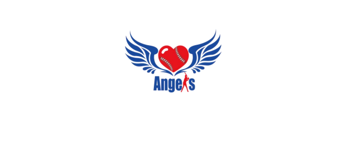
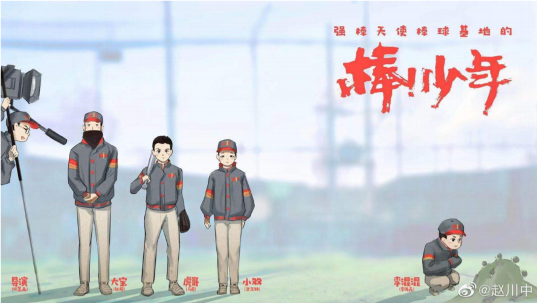

---
layout: post
title:  "强棒天使项目"
image:
  feature: 强棒天使图标.png
  feature: 强棒天使图标2.png
  feature: 强棒天使图标3.png
  topPosition: 0px
bgContrast: dark
bgGradientOpacity: darker
syntaxHighlighter: no
---  
        
### 项目起源  
随着棒球产业的不断发展，棒球人才的需求量越来越多，棒球人才的未来机遇也将前所未有。  
强棒基地由前国家棒球队队长孙岭峰与爱心人士联合筹资建设，中国队长的梦想--用棒球给困境中的孩子一个选择未来的机会！  
### 项目意义  
> 授人以鱼不如授人以渔  
> 
    基地主要资助对象为全国范围内7-10岁困境儿童，通过专业的棒球技能获得职业发展方向和未来的就业机会。  
    在解决基本问题的同时，塑造健全、独立品格，帮助他们实现人生目标。  
### 发展历程  
五年搬了四次家，至2020年11月，项目共资助困境儿童80名，其中女孩26名。
